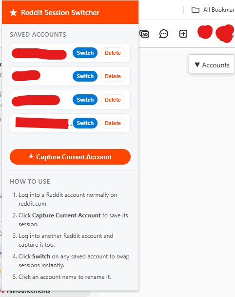

# 🔄 Reddit Session Switcher

> Switch between multiple Reddit accounts with one click.

A lightweight, privacy-focused Chrome extension that lets you save and instantly switch between multiple Reddit sessions without repeatedly logging in and out.

  

  
  
  
  

---

## ✨ Features

- 🚀 One-click account switching
- 💾 Save unlimited Reddit sessions
- 📝 Rename saved accounts
- 🗑️ Delete accounts anytime
- 🔒 Stores data locally
- 🔐 Never stores passwords
- 🪶 Lightweight and fast
- 🌐 Floating account switcher on Reddit
- 🔀 Drag to reorder saved accounts

---

## 📦 Installation

### Chrome / Edge / Brave / Opera / Vivaldi

1. Clone or download this repository.
2. Open your browser's Extensions page.
3. Enable **Developer Mode**.
4. Click **Load unpacked**.
5. Select this project's folder.

Done!

---

## 🚀 Usage

1. Log into Reddit.
2. Press **Capture Current Account**.
3. Log into another Reddit account.
4. Capture it as well.
5. Switch between accounts with one click.

You can also use the floating **Accounts** menu directly on Reddit pages.

Drag saved accounts in the popup to reorder them — the order is saved locally.

---

## 🔒 Privacy

Everything stays on **your computer**.

The extension:

- ✅ Never uploads data
- ✅ Never tracks users
- ✅ Never stores passwords
- ✅ Only stores Reddit session cookies locally

See **PRIVACY.md** for more information.

---

## ⚠️ Limitations

- Reddit sessions eventually expire.
- Simply log in again and capture the account if needed.
- Best compatibility with:
  - reddit.com
  - old.reddit.com

---

## ❤️ Support Development

If this extension saves you time, consider supporting future updates.

---

## 📄 License

Licensed under the **MIT License**.
